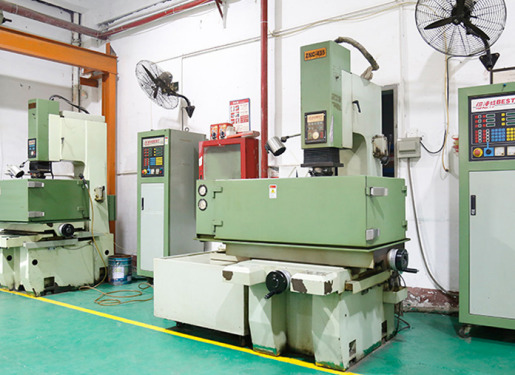

.. mold documentation master file, created by
   sphinx-quickstart on Sat Jun 15 15:24:46 2024.
   You can adapt this file completely to your liking, but it should at least
   contain the root `toctree` directive.
=======================
Our Facilities
=======================

Work Areas and Operating Space
	•	3,000 square meters

CNC Machining Centers: 1 unit
	•	Capacity: Up to 0.002 mm tolerance

Electrical Discharge Machines (EDM): 4 units

Wire Cut EDM Machines: 1 unit
	•	Capacity: Precision up to 0.1 mm

Grinding Machines: 3 units
	•	Capacity: Surface finish up to Ra 0.2

Milling Machines: 4 units

Injection Molding Machines: 10 units
	•	Capacity: Clamping force range from 50 to 500 tons

Coordinate Measuring Machines (CMM): 1 unit
	•	Capacity: Precision measurement up to 0.002 mm

Overhead Cranes
	•	Capacity: Up to 10 tons
