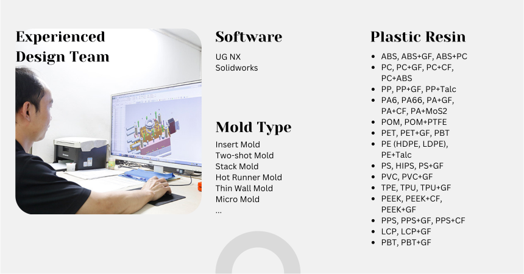

.. mold documentation master file, created by
   sphinx-quickstart on Sat Jun 15 15:24:46 2024.
   You can adapt this file completely to your liking, but it should at least
   contain the root `toctree` directive.

.. _mold-design:

=======================
Mold Design
=======================

At CenterMold, our mold design team work hard to meet the unique needs of each client, ensuring the high levels of precision, efficiency, and quality. With over 30 years of experience in design, tooling, and injection molding, we leverage advanced design software and a customer-centric approach to deliver exceptional results.

 .. figure:: _static/design_process.svg
   :align: center

.. raw:: html

   

Our Design Software
--------------------
To provide the best mold design services, we utilize industry-leading software such as:

- UG NX
- SolidWorks

Mold Design Process
------------------------

Our team of seasoned professionals brings decades of expertise in mold design and manufacturing.

1. Requirement Analysis and Design Review
~~~~~~~~~~~~~~~~~~~~~~~~~~~~~~~~~~~~~~~~~~~
..

2. Mold Concept and 3D design
~~~~~~~~~~~~~~~~~~~~~~~~~~~~~~~~~~
..

  - Developing initial design concepts and discussing potential approaches with the client.  
  - Specifying the location, type, and size of the gate to ensure optimal flow and minimal defects.  
  - Clearly defining the parting line to ensure proper mold separation.
  - Placing ejector pins to ensure smooth part removal.
..
.. raw:: html

   

3. Mold Flow and Detail Design
~~~~~~~~~~~~~~~~~~~~~~~~~~~~~~~~~~~
..

  - :ref:`Mold-flow` 
  - Designing efficient cooling channels to maintain consistent temperature and reduce cycle times
  - Designing molds with export requirements in mind, considering the client's injection molding machine specifications.
 

4. Client Communication and Approval and CAM Ready Validation
~~~~~~~~~~~~~~~~~~~~~~~~~~~~~~~~~~~~~~~~~~~~~~~~~~~~~~~~~~~~~~~~~~~~
..

  - Conducting detailed design reviews with the client to ensure all requirements and expectations are met.
  - Incorporating client feedback and making necessary adjustments.
  - Securing client approval on the final design before proceeding to manufacturing.

.. raw:: html

   <a href="_static/RFQ.pdf" style="
      display: inline-block;
      padding: 15px 30px;  /* 增加内边距，使按钮更大 */
      background-color: #2980B9;
      color: white;
      text-align: center;
      text-decoration: none;
      border-radius: 5px;
      position: fixed;
      right: 0;
      top: 50%;
      transform: translateY(-50%);
      margin-right: 10px;
      font-size: 18px;  /* 增加字体大小 */
      line-height: 20px;">
      Get Instant Quote
   </a>

.. raw:: html

   

   <!-- 书签按钮，悬浮在页面顶部 80px 的位置 -->
   <button class="bookmark-btn" onclick="bookmarkPrompt()">Add Bookmark</button>

   
