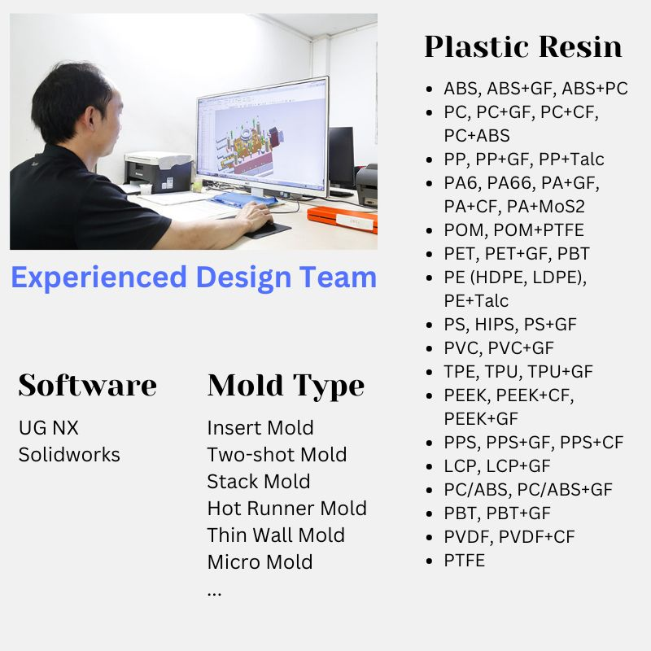

.. mold documentation master file, created by
   sphinx-quickstart on Sat Jun 15 15:24:46 2024.
   You can adapt this file completely to your liking, but it should at least
   contain the root `toctree` directive.

.. _mold-design:

=======================
Mold Design
=======================

   

At CenterMold, our mold design team work hard to meet the unique needs of each client, ensuring the high levels of precision, efficiency, and quality. With over 30 years of experience in design, tooling, and injection molding, we leverage advanced design software and a customer-centric approach to deliver exceptional results.

Our Design Software
--------------------
To provide the best mold design services, we utilize industry-leading software such as:

- UG NX
- SolidWorks

Mold Design Process
------------------------
Our team of seasoned professionals brings decades of expertise in mold design and manufacturing.

1. Initial Consultation and Design Review  
..
  
  - Needs Assessment: Understanding the client’s requirements, product specifications, and manufacturing goals.
  - Conceptual Design: Developing initial design concepts and discussing potential approaches with the client.  
  -  Gate Location and Type: Specifying the location, type, and size of the gate to ensure optimal flow and minimal defects.  
  - Parting Line: Clearly defining the parting line to ensure proper mold separation and ease of manufacturing.
  - Ejector Pin Placement: Placing ejector pins to ensure smooth part removal without damaging the product.
..

2. Detailed Design
..

  - 3D Modeling
  - :ref:`Mold-flow` 
  - Design for Manufacturability (DFM)
  - Cooling System Design: Designing efficient cooling channels to maintain consistent temperature and reduce cycle times
  - Export mold Considerations: Designing molds with export requirements in mind, considering the client's injection molding machine specifications.
 

3. Client Communication and Approval
..

  - Design Reviews: Conducting detailed design reviews with the client to ensure all requirements and expectations are met.
  - Feedback and Iteration: Incorporating client feedback and making necessary adjustments.
  - Final Approval: Securing client approval on the final design before proceeding to manufacturing.

:ref:`Mold-flow` help us improve mold design process.

Comprehensive Support
----------------------------------------

At CenterMold, we provide detailed design documentation to ensure that even those unfamiliar with mold design can easily understand the production details. Our design packages include:

  - Detailed Design Drawings: Clear and precise drawings highlighting all critical aspects of the mold, such as gate locations, parting lines, and ejector pin placements.
..
  
  - Component Lists: Comprehensive lists of all mold components, including dimensions and specifications, ensuring complete transparency.

.. raw:: html

   <a href="_static/RFQ.pdf" style="
      display: inline-block;
      padding: 15px 30px;  /* 增加内边距，使按钮更大 */
      background-color: #2980B9;
      color: white;
      text-align: center;
      text-decoration: none;
      border-radius: 5px;
      position: fixed;
      right: 0;
      top: 50%;
      transform: translateY(-50%);
      margin-right: 10px;
      font-size: 18px;  /* 增加字体大小 */
      line-height: 20px;">
      Get Instant Quote
   </a>
