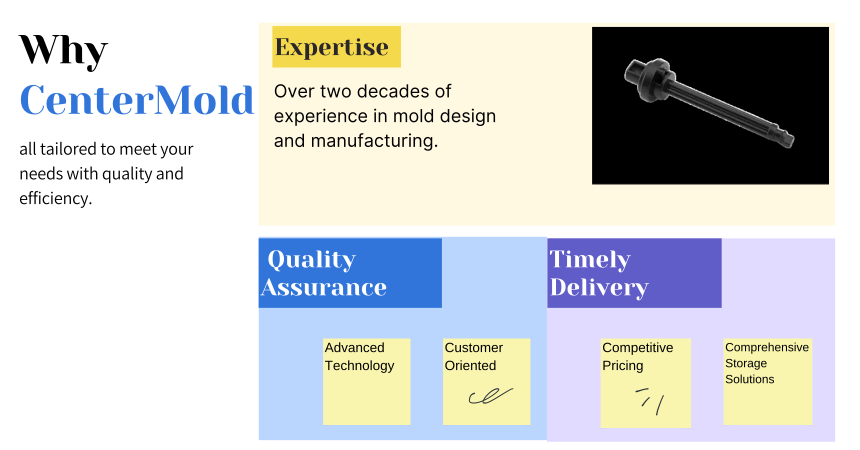
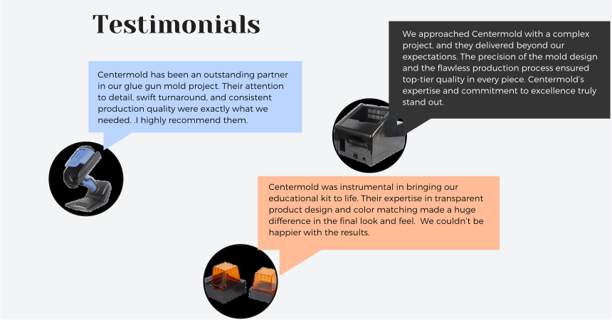

.. mold documentation master file, created by
   sphinx-quickstart on Sat Jun 15 15:24:46 2024.
   You can adapt this file completely to your liking, but it should at least
   contain the root `toctree` directive.

.. _Mold-partner:

==================================
Manufacturing Partner
==================================

At CenterMold, we pride ourselves on being a trusted partner for overseas companies, particularly those in the UK and North America. we are well-versed in European and North American standards, providing unparalleled service and support to our international partners.

Why choose us?
---------------------------
.. raw:: html

   

.. raw:: html

   

1. Expertise

With over 20 years of experience, we excel in designing and manufacturing molds for various applications. Our team has worked with more than 30 types of plastic materials and specializes in multiple mold types, ensuring precise, efficient, and reliable production. We adhere to international standards, delivering trusted solutions tailored to your needs.

2. Quality Assurance

We utilize advanced manufacturing equipment and cutting-edge design software to ensure precision at every step. Our strict quality management processes, combined with a dedicated and experienced team, guarantee that every mold meets the highest performance and durability standards.

3. Flexible and Timely Delivery

We are committed to a customer-centric approach, ensuring that every need is met efficiently. Our flexible production and storage solutions support timely delivery, enabling quick turnaround and adaptability to market demands. With competitive pricing, we guarantee high-quality results and reliable service, delivering excellence without compromise.

New Product Development Supporting
-----------------------------------
We specialize in supporting new product development projects, which often require frequent adjustments and refinements. Our flexible approach and dedication to continuous improvement make us an ideal partner for companies looking to innovate and adapt quickly.

- Prototyping and Testing: We provide rapid prototyping services to help you test and refine your designs.
- Ongoing Support: Our commitment to long-term partnerships means we provide ongoing support and maintenance.

Long-Term Partnerships
-------------------------
.. raw:: html

   

.. raw:: html

   

Our long-standing relationships with mold factories in the UK and North America are a testament to our collaborative success. By working closely with our partners, we achieve Mutual Growth and Trust.

.. raw:: html

   <a href="_static/RFQ.pdf" style="
      display: inline-block;
      padding: 15px 30px;  /* 增加内边距，使按钮更大 */
      background-color: #2980B9;
      color: white;
      text-align: center;
      text-decoration: none;
      border-radius: 5px;
      position: fixed;
      right: 0;
      top: 50%;
      transform: translateY(-50%);
      margin-right: 10px;
      font-size: 18px;  /* 增加字体大小 */
      line-height: 20px;">
      Get Instant Quote
   </a>
