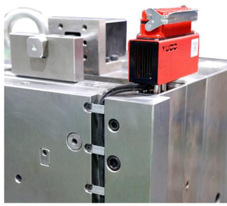

.. mold documentation master file, created by
   sphinx-quickstart on Sat Jun 15 15:24:46 2024.
   You can adapt this file completely to your liking, but it should at least
   contain the root `toctree` directive.
.. _Mold-tooling:

=======================
Mold Tooling
=======================

CenterMold is dedicated to delivering top-tier molds through a comprehensive and precisely controlled manufacturing process. Our commitment to quality and precision drives us to continuously refine our methods, ensuring we meet the diverse needs of our clients.

Our Manufacturing Process

.. figure:: _static/Mold-Tooling.jpg
   :align: right
   :width: 300px

1. Material Procurement

  - Mold Base Selection: Choosing the appropriate mold base according to the design requirements and specifications.
  - Core and Cavity Steel: Selecting high-quality steel for the core and cavity to ensure durability and performance.
  - Mold Components: Sourcing essential mold components such as ejector pins, guide pins, bushings, and other standard parts.

2. Initial Design and Planning

  - Ensuring all design aspects are finalized and approved.
  - Creating a detailed project plan outlining all stages of the manufacturing process, timelines.

3. CNC Machining

  - Rough Machining
  - Precision Machining: Utilizing advanced CNC machines to achieve precise dimensions and tolerances.
  - Dimensional Inspection: Conducting rigorous inspections to verify dimensions and tolerances.

4. EDM (Electrical Discharge Machining)

  - Sinker EDM: Creating complex shapes and fine details in mold components.
  - Wire EDM: Cutting intricate shapes.
  - Quality Control: ensure accuracy and surface finish meet quality standards.

.. raw:: html

   

1. Grinding and Polishing

  - Surface Grinding: Achieving precise flatness and smooth surfaces.
  - Polishing: Hand and machine polishing to achieve the required surface finish and texture.
  - Inspection: Verifying surface finish and dimensional accuracy through detailed inspection.

6. Heat Treatment(optional)

  - Hardening: Applying heat treatment processes to enhance the hardness and durability of mold steel.
  - Tempering
  - Hardness Testing: Performing hardness tests to ensure the treated components meet the required specifications.

7. Fitting and Assemble

  - Component Fitting: Assembling mold components and ensuring proper fit and function.
  - Final Machining: Performing any necessary final machining operations to ensure all parts fit together seamlessly.
  - Dimensional Verification: Conducting dimensional inspections to verify all components meet design requirements.

.. raw:: html

    <video width="560" controls autoplay muted>
      <source src="_static/centermold workshop.mp4" type="video/mp4">
      Your browser does not support the video tag.
    </video>

8. Testing and Validation

  - Trial Runs: Conducting trial runs to test the mold.
  - Performance Evaluation: Assessing mold performance, identifying any issues, and making necessary adjustments.
  - Client Approval: Securing final client approval.

9. Packaging and Delivery

  - Protective Packaging: Ensuring molds are securely packaged to prevent damage during transportation.
  - Logistics Coordination: Coordinating with logistics partners to ensure timely and safe delivery to clients.

.. raw:: html

   <a href="_static/RFQ.pdf" style="
      display: inline-block;
      padding: 15px 30px;  /* 增加内边距，使按钮更大 */
      background-color: #2980B9;
      color: white;
      text-align: center;
      text-decoration: none;
      border-radius: 5px;
      position: fixed;
      right: 0;
      top: 50%;
      transform: translateY(-50%);
      margin-right: 10px;
      font-size: 18px;  /* 增加字体大小 */
      line-height: 20px;">
      Get Instant Quote
   </a>
