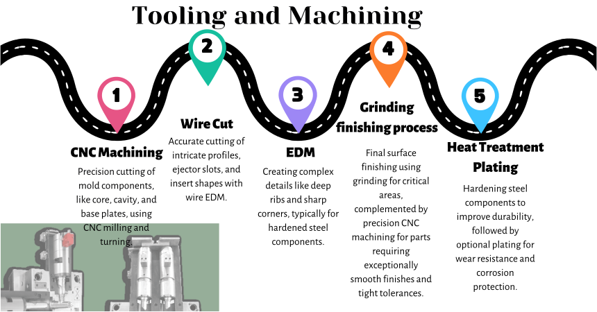

.. mold documentation master file, created by
   sphinx-quickstart on Sat Jun 15 15:24:46 2024.
   You can adapt this file completely to your liking, but it should at least
   contain the root `toctree` directive.
.. _Mold-tooling:

=======================
Mold Tooling
=======================
.. .. figure:: _static/moldtooling.jpg
   :align: right
   :width: 400px

CenterMold is dedicated to delivering top-tier molds through a comprehensive and precisely controlled manufacturing process. Our commitment to quality and precision drives us to continuously refine our methods, ensuring we meet the diverse needs of our clients.

Our Manufacturing Process

.. raw:: html

   

Material Procurement
---------------------

  - Mold Base Selection: Choosing the appropriate mold base according to the design requirements and specifications.
  - Core and Cavity Steel: Selecting high-quality steel for the core and cavity to ensure durability and performance.
  - Mold Components: Sourcing essential mold components such as ejector pins, guide pins, bushings, and other standard parts.

Precision Tooling and Machining
---------------------------------

.. raw:: html

   

.. raw:: html
   

.. figure:: _static/Process02.svg
   :align: center

.. raw:: html
   
   

  - Rough Machining
  - Precision Machining: Utilizing advanced CNC machines to achieve precise dimensions and tolerances.
  - Sinker EDM: Creating complex shapes and fine details in mold components.
  - Wire EDM: Cutting intricate shapes.
  - Surface Grinding: Achieving precise flatness and smooth surfaces.
  - Polishing: Hand and machine polishing to achieve the required surface finish and texture.
  - Inspection: Verifying surface finish and dimensional accuracy through detailed inspection.
  
Heat Treatment and Surface finishing(optional)
------------------------------------------------

  - Hardening: Applying heat treatment processes to enhance the hardness and durability of mold steel.
  - Tempering
  - Hardness Testing: Performing hardness tests to ensure the treated components meet the required specifications.

Fitting and Assemble
------------------------
  - Assembling mold components and ensuring proper fit and function.
  - Performing any necessary final machining operations to ensure all parts fit together seamlessly.
  - Conducting dimensional inspections to verify all components meet design requirements.

T0 Trial shot
---------------

  - Conducting trial runs to test the mold.
  - Assessing mold performance, identifying any issues, and making necessary adjustments.

.. raw:: html

    <video width="700" controls autoplay muted>
      <source src="_static/centermold workshop.mp4" type="video/mp4">
      Your browser does not support the video tag.
    </video>

.. raw:: html

   <a href="_static/RFQ.pdf" style="
      display: inline-block;
      padding: 15px 30px;  /* 增加内边距，使按钮更大 */
      background-color: #2980B9;
      color: white;
      text-align: center;
      text-decoration: none;
      border-radius: 5px;
      position: fixed;
      right: 0;
      top: 50%;
      transform: translateY(-50%);
      margin-right: 10px;
      font-size: 18px;  /* 增加字体大小 */
      line-height: 20px;">
      Get Instant Quote
   </a>
