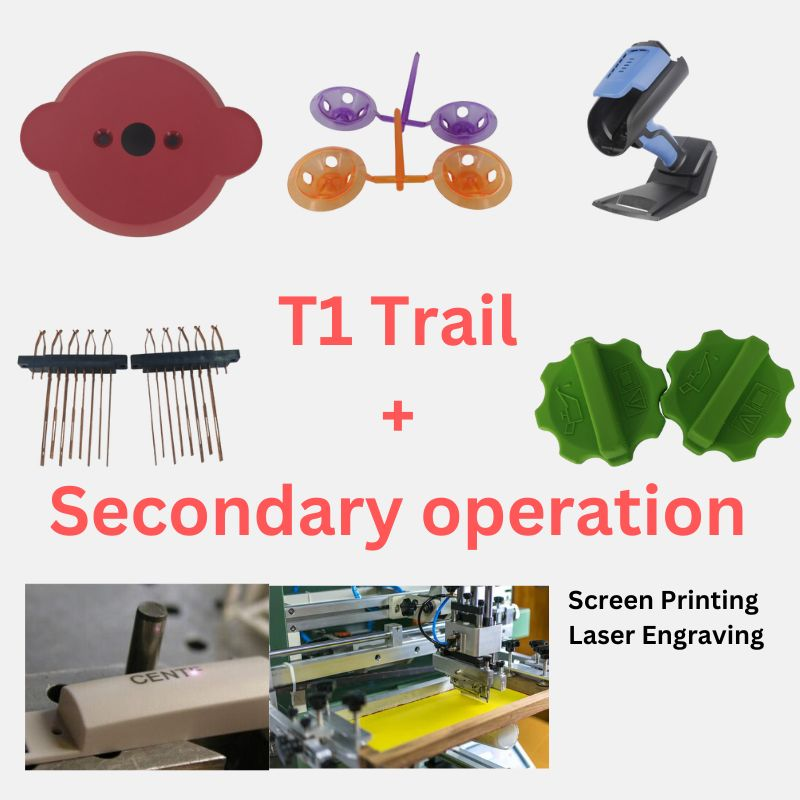

.. mold documentation master file, created by
   sphinx-quickstart on Sat Jun 15 15:24:46 2024.
   You can adapt this file completely to your liking, but it should at least
   contain the root `toctree` directive.
.. _Other-service:

=======================
Other Services
=======================

Additional Post-Injection Molding Services
At CenterMold, we offer a comprehensive range of post-injection molding services to meet all our customers' needs. Beyond injection molding, our services include:

- Silk Screening 
- Laser Engraving
- Color Matching
- Assembly and Sub-Assembly: Integration of multiple components into finished assemblies to streamline production and reduce costs.
- 

Contact us today to discover how we can support your project with our expertise and capabilities.

.. raw:: html

   <a href="_static/RFQ.pdf" style="
      display: inline-block;
      padding: 15px 30px;  /* 增加内边距，使按钮更大 */
      background-color: #2980B9;
      color: white;
      text-align: center;
      text-decoration: none;
      border-radius: 5px;
      position: fixed;
      right: 0;
      top: 50%;
      transform: translateY(-50%);
      margin-right: 10px;
      font-size: 18px;  /* 增加字体大小 */
      line-height: 20px;">
      Get Instant Quote
   </a>

