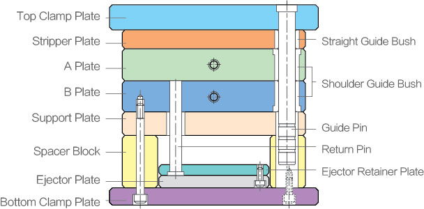

.. mold documentation master file, created by
   sphinx-quickstart on Sat Jun 15 15:24:46 2024.
   You can adapt this file completely to your liking, but it should at least
   contain the root `toctree` directive.
.. _Partners:

=======================
Our Partners
=======================

Our success is built not only on our expertise and dedication but also on the strong partnerships we have cultivated over the years. These partnerships ensure we can consistently deliver high-quality products and services. Our key partners include:

   Material Suppliers:

    * Mold Steel Suppliers: We source our mold steel from reputable suppliers such as LKM. These suppliers are renowned for their high-quality materials, ensuring the durability and precision of our molds.
    * Plastic Resin Suppliers: Our plastic resins come from leading manufacturers like CHIMEI, DuPont, and BASF, providing a wide range of materials that meet the specific requirements of our  projects.

   Hot Runner Systems:

    * We collaborate with hot runner system suppliers such as YUDO, HASCO. These systems enhance mold performance by improving material flow and reducing cycle times.

   Injection Molding Machine Manufacturers:

    * Our facility is equipped with state-of-the-art machinery from manufacturers like Nissei, and Arburg. These machines ensure optimal performance and precision in our production processes to meet the stringent requirements of our clients.

   Logistics and Freight Companies:

    * For ocean freight, we collaborate with reputable shipping companies like OOCL, Maersk, and Hapag-Lloyd to handle bulk shipments efficiently.
    * For smaller, time-sensitive shipments, we work with FedEx, UPS  and DHL that guarantee fast and secure delivery.

.. raw:: html

   <a href="_static/RFQ.pdf" style="display: inline-block; padding: 10px 20px; background-color: green; color: white; text-align: center; text-decoration: none; border-radius: 5px;">
      Get Instant Quote
   </a>