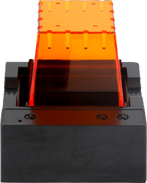

.. mold documentation master file, created by
   sphinx-quickstart on Sat Jun 15 15:24:46 2024.
   You can adapt this file completely to your liking, but it should at least
   contain the root `toctree` directive.
=======================
Profile
=======================

CenterMold: Your Partner in Precision Plastic Mold Manufacturing

Located in Shenzhen, Guangdong, the heart of China’s mold industry and conveniently near Hong Kong, CenterMold is a private company specializing in plastic mold manufacturing. Our strategic location provides excellent transportation benefits, ensuring timely delivery and efficient logistics.

Established in 2003, CenterMold has grown into a medium-scale mold factory, boasting a 3,000 square meter facility and a dedicated team of 30 skilled employees. Our state-of-the-art manufacturing equipment, including CNC machines, EDM, and wire-cutting technology, allows us to produce up to 40 large to medium-sized molds per month.

Strategic Location and Shipping Advantages

Our proximity to major ports in Shenzhen and Hong Kong offers significant advantages for international shipping. We have access to numerous direct sea routes, ensuring fast and cost-effective delivery to major ports around the world.

Shenzhen or Hongkong - North America

- Los Angeles, CA
- Long Beach, CA
- New York, NY
- Savannah, GA
- Vancouver, BC

Shenzhen or Hongkong - Europe

- Rotterdam, Netherlands
- Hamburg, Germany
- Antwerp, Belgium
- Le Havre, France
- Barcelona, Spain

Shenzhen or Hongkong - United Kingdom

- Southampton
- Liverpool

Our strategic location and efficient logistics network enable us to offer competitive shipping rates and reliable delivery schedules, ensuring your molds and products arrive on time and within budget.

