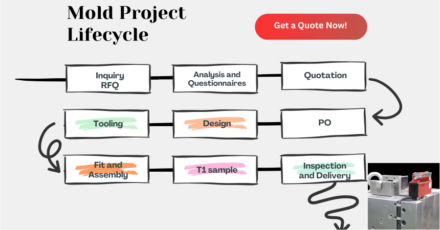
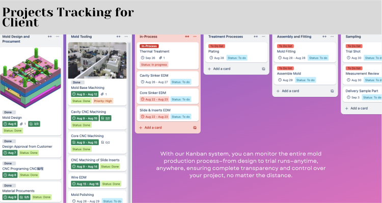

.. mold documentation master file, created by
   sphinx-quickstart on Sat Jun 15 15:24:46 2024.
   You can adapt this file completely to your liking, but it should at least
   contain the root `toctree` directive.
.. _Project-management:

=======================
Project Management
=======================
At CenterMold, we ensure that every step of the mold project is planned and executed to guarantee success. From creating detailed timelines and adhering to schedules to maintaining communication with clients, our goal is to deliver outstanding quality and ensure the success of every project. 

.. raw:: html

   

.. raw:: html

   

1. Initial Planning

    * Understanding the client’s needs, specifications.
    * Conducting a feasibility study to assess potential challenges.
    * Creating a detailed project plan, including timelines, milestones.

2. Order Confirmation and Scheduling

    * Detailed Timeline: Upon receiving an order, we create a detailed timeline outlining every phase of the project.
    
3. Design and Engineering

    * Design for Manufacturability
    * Modeling: Creating detailed 3D models using software like UG and SolidWorks.
    * Client Approval: Reviewing designs with the client.

4. Mold Fabrication

    * Material Procurement
    * Machining
    * Heat Treatment: Applying heat treatment to enhance material properties and durability.
    * Fitting and Assembly: Assembling the mold components and ensuring precise alignment and fit.

5. Quality Control and Testing

    * Dimensional Inspection
    * Functional Testing
    * Sample Production: Producing sample parts for client approval.

6. Project Monitoring and Control

    * Progress Tracking: Continuously monitoring project progress against the plan.
    * Client Updates: Providing regular updates to the client on project status.
    * Timely Communication: Ensuring prompt communication with clients for any design changes or additional requirements, adjusting plans and schedules as needed.

7. Delivery and Support

    * Final Inspection
    * Logistics Coordination
    * After-Sales Support: Offering ongoing support and maintenance services as needed.

Management Template
--------------------
We make some useful resouces document for download, Get more :ref:`resources-download`  

.. raw:: html

   <a href="_static/RFQ.pdf" style="
      display: inline-block;
      padding: 15px 30px;  /* 增加内边距，使按钮更大 */
      background-color: #2980B9;
      color: white;
      text-align: center;
      text-decoration: none;
      border-radius: 5px;
      position: fixed;
      right: 0;
      top: 50%;
      transform: translateY(-50%);
      margin-right: 10px;
      font-size: 18px;  /* 增加字体大小 */
      line-height: 20px;">
      Get Instant Quote
   </a>
