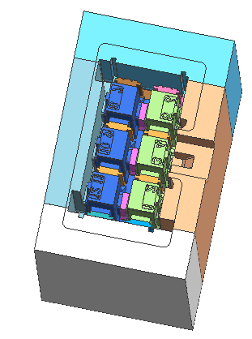

.. _RFQ:

====================================
RFQ of CenterMold
====================================

CenterMold understand that providing an accurate and comprehensive quotation is essential to the success of your project. Our quotation process is thorough and detailed, ensuring that we meet your specific needs.

Quotation Process Overview
===========================

Our quotation process involves several key steps to ensure we capture all necessary details and provide an accurate estimate. Here is an overview of our professional quotation process:

1. Initial Consultation and Requirement Gathering
- Client Interaction: We begin with an discussion to understand your project requirements gathering information about the functionality, usage, and production plans.
- Document Review: We review product design documents, technical drawings, or samples you provide. This helps us understand the specifications and complexity of the mold.

1. Technical Evaluation
- Design Analysis: Our engineering team analyzes the designs and samples to assess feasibility and identify potential challenges. We consider factors such as part geometry, material selection, and design intricacies.
- Functionality and Tolerance: We evaluate the required tolerances and functionality of the final product to determine the precision and complexity of the mold.
  
1. Material and Component Selection
- Based on the product specifications and expected production volume, we select appropriate materials for the mold base, cavity, and core. 
- Surface Treatment: the necessary surface treatments like nitriding, polishing, texturing to enhance the durability and performance of the mold.

1. Manufacturing Considerations
- Production Volume: We consider the molds longevity and robustness according to your production plans
- Cavity Configuration: We discuss and decide on the number of cavities and whether multiple parts can be produced in a single mold.
- Export Requirements: If the mold is intended for export, we take into account additional standards and certifications required for international shipping and usage.

1. Cost Estimation
- Material Costs: calculating the cost of raw materials, including mold base, steel, and surface treatments.
- Manufacturing Costs: estimating the cost of CNC machining, EDM, assembly, and any other manufacturing processes involved.
- Labor Costs: We factor in the labor required for design, manufacturing, and quality control.
- Trial Production: a cost estimate for initial trial production runs to validate the mold.

1. Quotation Preparation
- Detailed Quotation: We prepare a comprehensive quotation that includes a breakdown of all costs, estimated lead times, and terms of service. This will cover:
  - Total cost of the mold
  - Material specifications
  - Number of cavities
  - Estimated production lead time
  - Surface treatment details
  - Delivery Schedule: We provide a detailed timeline for mold production, including key milestones and expected delivery dates.

1. Client Review and Approval
- Quotation Presentation: We present the quotation to you, explaining each component in detail and addressing any questions or concerns.
- Feedback and Revisions: We welcome your feedback and are prepared to make any necessary revisions to ensure the quotation meets your expectations and requirements.
  
1. Final Agreement and Contract Signing
- Formal Agreement: Once you are satisfied with the quotation, we finalize the agreement and proceed with contract signing.
- Project Kickoff: Upon contract approval, we initiate the mold manufacturing process, keeping you informed at every stage.

Why Choose Us?
----------------

- Expertise and Experience: Our team has extensive experience in mold manufacturing and understands the nuances of creating high-quality molds.
- Transparency and Communication: We believe in maintaining open communication with our clients, providing clear and detailed information throughout the process.
- Commitment to Quality: We are committed to delivering molds that meet the highest standards of quality and performance.
- Timely Delivery: We adhere to agreed timelines, ensuring your project stays on schedule.

CenterMold are confident that our professional approach and attention to detail will provide you with a mold that meets your specifications and contributes to the success of your project. We look forward to the opportunity to work with you.

.. raw:: html

    

    <a href="mailto:info@centermold.com" class="email-button">RFQ for Mail</a>

  .. raw:: html

   <a href="static/MyDocument.pdf" style="
      display: inline-block;
      padding: 15px 30px;  /* 增加内边距，使按钮更大 */
      background-color: #2980B9;
      color: white;
      text-align: center;
      text-decoration: none;
      border-radius: 5px;
      position: fixed;
      right: 0;
      top: 50%;
      transform: translateY(-50%);
      margin-right: 10px;
      font-size: 18px;  /* 增加字体大小 */
      line-height: 20px;">
      Get Instant Quote
   </a>
