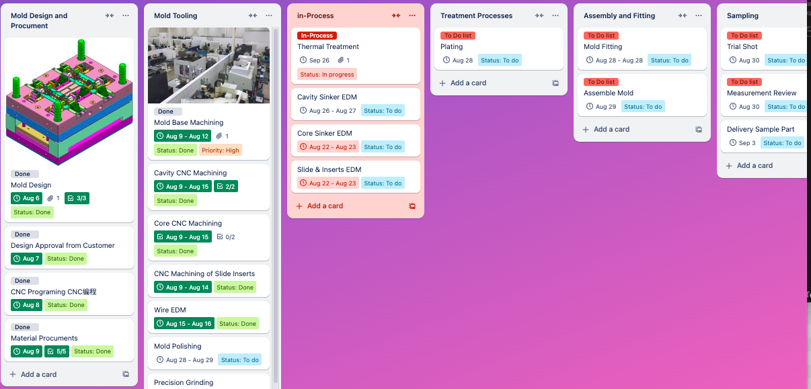
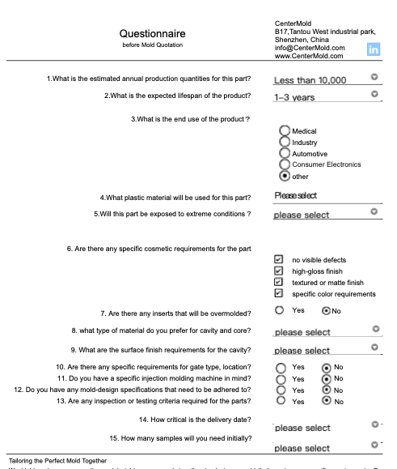

.. mold documentation master file, created by
   sphinx-quickstart on Sat Jun 15 15:24:46 2024.
   You can adapt this file completely to your liking, but it should at least
   contain the root `toctree` directive.
.. _resources-download:

================
Resources
================

Welcome to our Document Download Center! We have created a range of practical documents designed to assist engineers and project managers in communicating requirements, optimizing mold designs, and managing projects. Whether you're working on mold design, tracking project progress, or discussing specific needs, these documents will provide valuable support. Download now to enhance your workflow and ensure smooth project execution.

Trello Template
----------------
Here’s a Trello Mold Management Template designed to streamline the entire mold development process. From design and manufacturing to assembly, de-molding, and testing, this template helps you efficiently manage every stage of the project. Use it to quickly set up and oversee all phases of mold production.

`Trello Mold Project Management Template <https://trello.com/b/gFxcTwyo>`_

Question Before Quotation
--------------------------

We highly value your expertise and insights as we work together to design a mold that meets your specific requirements. By
understanding your product’s demands, material choices, and production needs, we can create a mold that balances quality,
efficiency, and cost-effectivenes

Download the PDF version of this documentation: `Questionnaire before Quotation <_static/question_before_quotation_from_centermold.pdf>`_

   

Download the PDF about `Request for Quotation <_static/RFQ.pdf>`_

.. raw:: html

   <a href="static/MyDocument.pdf" style="
      display: inline-block;
      padding: 15px 30px;  /* 增加内边距，使按钮更大 */
      background-color: #2980B9;
      color: white;
      text-align: center;
      text-decoration: none;
      border-radius: 5px;
      position: fixed;
      right: 0;
      top: 50%;
      transform: translateY(-50%);
      margin-right: 10px;
      font-size: 18px;  /* 增加字体大小 */
      line-height: 20px;">
      Get Instant Quote
   </a>
