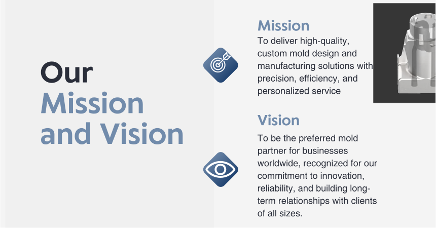
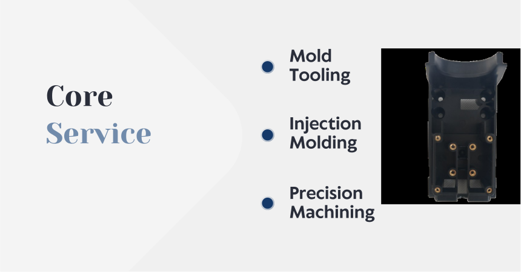
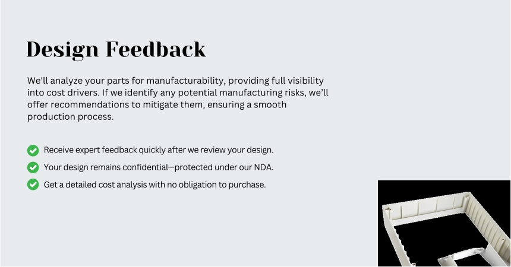
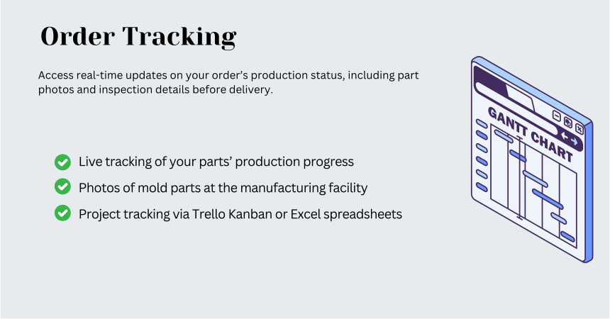

.. mold documentation master file, created by
   sphinx-quickstart on Sat Jun 15 15:24:46 2024.
   You can adapt this file completely to your liking, but it should at least
   contain the root `toctree` directive.
.. _Home:

=======================
Welcome to CenterMold!
=======================

.. toctree::
   :maxdepth: 2
   :hidden:
   :caption: Services
   
   Home
   Mold-Design
   Mold-Tooling
   Injection-Molding
   Moldflow
   Other-Services

.. toctree::
   :maxdepth: 2
   :hidden:
   :caption: Specialized Services
   
   Manufacturing
   Mold-Partners

.. toctree::
   :maxdepth: 2
   :hidden:
   :caption: Project Management
   
   Project-Process-Management

.. toctree::
   :maxdepth: 2
   :hidden:
   :caption: About Us
   
   Profile
   Facility
   Contact-Us

.. toctree::
   :maxdepth: 2
   :hidden:
   :caption: Resource

   Resource

.. .. raw:: html
  
   
.. 

.. raw:: html

   

   
.. raw:: html

   

.. raw:: html

   

   
.. raw:: html

   

.. raw:: html

   

      
   

.. raw:: html

   

   
.. raw:: html

   

   
.. raw:: html

   

.. .. image:: _static/project_lifecycle.svg
   :align: center
   :target: mailto:inquiry@centermold.com

.. raw:: html

   

      
   

.. raw:: html

   

.. raw:: html

    

      <video width="850" controls autoplay muted>
        <source src="_static/indexofCenterMold.mp4" type="video/mp4">
        Your browser does not support the video tag.
      </video>
    

.. raw:: html

   <a href="_static/RFQ.pdf" style="
      display: inline-block;
      padding: 15px 30px;  /* 增加内边距，使按钮更大 */
      background-color: #2980B9;
      color: white;
      text-align: center;
      text-decoration: none;
      border-radius: 5px;
      position: fixed;
      right: 0;
      top: 50%;
      transform: translateY(-50%);
      margin-right: 10px;
      font-size: 18px;  /* 增加字体大小 */
      line-height: 20px;">
      Get Instant Quote
   </a>

.. raw:: html

    <meta name="description" content="Centermold provides advanced machining equipment and spacious, clean workspaces for exceptional mold manufacturing and injection molding.">
    <meta name="keywords" content="Centermold, mold manufacturing, injection molding, advanced machining, clean workspace">
    
