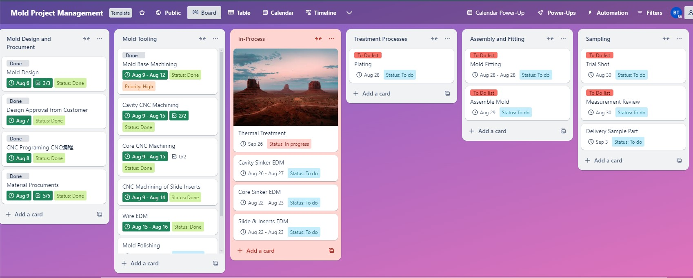

===============
Resources
===============

Welcome to our Document Download Center! We have created a range of practical documents designed to assist engineers and project managers in communicating requirements, optimizing mold designs, and managing projects. Whether you're working on mold design, tracking project progress, or discussing specific needs, these documents will provide valuable support. Download now to enhance your workflow and ensure smooth project execution.

Trello Template
----------------
Here’s a Trello Mold Management Template designed to streamline the entire mold development process. From design and manufacturing to assembly, de-molding, and testing, this template helps you efficiently manage every stage of the project. Use it to quickly set up and oversee all phases of mold production.

`Trello Mold Project Management Template <https://trello.com/b/gFxcTwyo>`_

