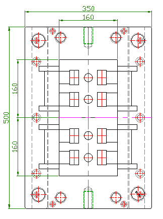

======================
reStructuredText 示例
======================

.. contents:: 目录
   :depth: 2

简介
====
这是一个包含了 reStructuredText 基本功能的示例文档。

段落和强调
==========
这是一个普通的段落。

这是一个 *斜体* 和 **粗体** 的示例。

列表
====
- 项目 1
- 项目 2
  - 子项目 1
  - 子项目 2

1. 项目 1
2. 项目 2
   1. 子项目 1
   2. 子项目 2

链接
====
参考 `其他部分 <#列表>`_ 的内容。

访问 `Python 官方网站 <https://www.python.org/>`_ 了解更多。

图片
====
.. image:: path/to/image.png
   :alt: 示例图片
   :width: 200px

代码块
======
.. code-block:: python

   def hello_world():
       print("Hello, world!")

表格
====
===  ===  ===
1    2    3
4    5    6
===  ===  ===

引用和注释
==========
这是一个引用：

    这是被引用的内容。

.. 这是一个注释，不会在生成的文档中显示。

角色
====
这是一个 :code:`print("Hello, world!")` 例子。

这是一个 :math:`e = mc^2` 例子。

脚注
====
这是一个脚注的例子 [1]_。

.. [1] 这是脚注的内容。

文档元数据
==========
:作者: John Doe
:日期: 2023-06-17

索引和交叉引用
=============
.. index:: single: reStructuredText; 教程

这是一个索引条目。

请参阅交叉引用中的 :ref:`简介 <简介>` 部分。

.. raw:: html

   <iframe width="560" height="315" src="https://www.youtube.com/embed/ole8Nr1xmGU?si=tkuqJFLeuxYgNFFX" title="YouTube video player" frameborder="0" allow="accelerometer; autoplay; clipboard-write; encrypted-media; gyroscope; picture-in-picture; web-share" referrerpolicy="strict-origin-when-cross-origin" allowfullscreen></iframe>

.. raw:: html

   <iframe
      src="https://udify.app/chatbot/YDwFl8rr4o76YTY1"
      
      style="position:fixed; top:50%; right:0; width: 300; height: 800; border:none; z-index: 1000;"
      frameborder="0"
      allow="microphone">
   </iframe>

