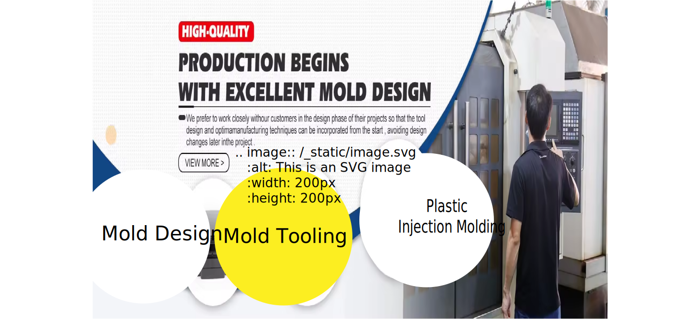

================
Chat With Us
================

.. raw:: html

   

   <map name="imagemap">
    <area target="_blank" alt="RFQ" title="RFQ" href="https://www.google.com" coords="77,507,392,557" shape="rect">
   </map>

.. raw:: html

 <iframe src="https://docs.google.com/forms/d/e/1FAIpQLSeafK6bSA1anWtcoY0RXEqqvOWYxtPBezz2k8aldk9Wx91jLQ/viewform?embedded=true" width="640" height="689" frameborder="0" marginheight="0" marginwidth="0">Loading…</iframe>
   
   
        

    

.. raw:: html
    
  <iframe src="https://widget.taggbox.com/157869" style="width:100%;height:600px;border:none;"></iframe>

.. list-table::
   :widths: 30 70
   :header-rows: 0

   * - .. image:: https://www.centermold.com/en/latest/_static/mold_design.jpg
        :width: 400px
        :align: left

     - **Mold Design**  
       
       Your paragraph text goes here. This can be multiple lines long.At CenterMold, our mold design team work hard to meet the unique needs of each client, ensuring the high levels of precision, efficiency, and quality. With over 30 years of experience in design, tooling, and injection molding, we leverage advanced design software and a customer-centric approach to deliver exceptional results.